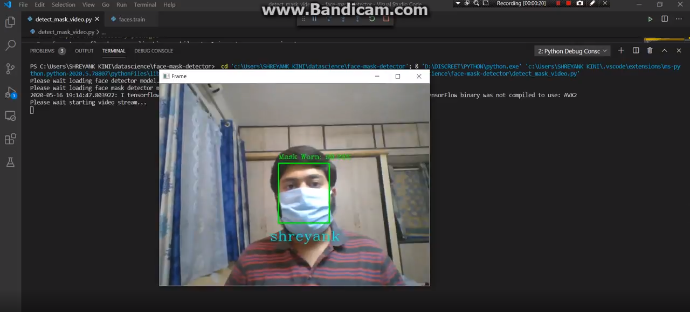

# Face Mask Detection and User Recognition

During this time of the pandemic, a face mask an essential when traveling. This project helps in the detection of a face mask worn by the user or not and also is capable to recognize the person upon training.

## Installation

Use the package manager [pip](https://pip.pypa.io/en/stable/) to install foobar.

```bash
pip install tensorflow
pip install keras
pip install pillow
pip install cv2
```

## Usage

- train_mask_detector.py: Accepts our input dataset and fine-tunes MobileNetV2 upon it to create our mask_detector.model.
- face_train.py: Accepts user input data of images and trains upon them thereby dumping the pickled model and label to be used in detection.
- detect_mask_video.py: Using your webcam, this script applies face mask detection to every frame in the stream to detect the presence of a mask and also uses the pickled model to identify the user.


## Screenshot and Video Demonstration of code



Please find the video demonstration here: 
https://www.linkedin.com/posts/shreyank-kini_ai-computervision-covid19-activity-6667426706208493568-0yi1
